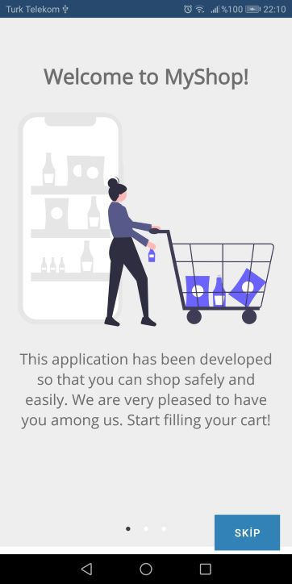
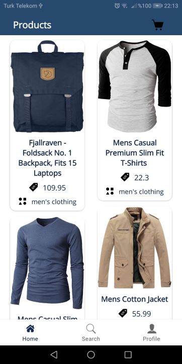
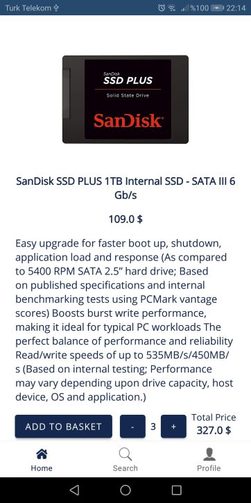
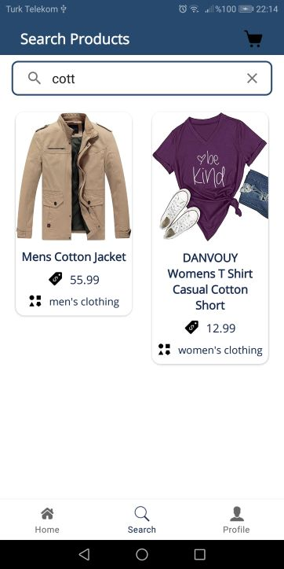
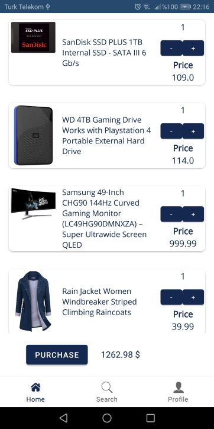

# MyShopApp 🛒
Android shopping app built with MVVM and Clean Architecture using [FAKE STORE API](https://fakestoreapi.com/)

## ScreenShots

Splash Screen             | First Onboarding Screen     | Second Onboarding Screen
:-------------------------:|:-------------------------:|:-------------------------:
            |    |   |

Third Onboarding Screen            | Login Screen               | Register Screen
:-------------------------:|:-------------------------:|:-------------------------:
           |                |   |

Products Screen            | Product Detail Screen               | Search Screen
:-------------------------:|:-------------------------:|:-------------------------:
           |                |   |

Basket Screen            |
:-------------------------:|
 

## Tech Stack
- [Kotlin](https://developer.android.com/kotlin) - Kotlin is a programming language that can run on JVM. Google has announced Kotlin as one of its officially supported programming languages in Android Studio; and the Android community is migrating at a pace from Java to Kotlin.
- Jetpack components:
    - [Android KTX](https://developer.android.com/kotlin/ktx.html) - Android KTX is a set of Kotlin extensions that are included with Android Jetpack and other Android libraries. KTX extensions provide concise, idiomatic Kotlin to Jetpack, Android platform, and other APIs.
    - [AndroidX](https://developer.android.com/jetpack/androidx) - Major improvement to the original Android [Support Library](https://developer.android.com/topic/libraries/support-library/index), which is no longer maintained.
    - [Lifecycle](https://developer.android.com/topic/libraries/architecture/lifecycle) - Lifecycle-aware components perform actions in response to a change in the lifecycle status of another component, such as activities and fragments. These components help you produce better-organized, and often lighter-weight code, that is easier to maintain.
    - [ViewModel](https://developer.android.com/topic/libraries/architecture/viewmodel) -The ViewModel class is designed to store and manage UI-related data in a lifecycle conscious way.
	- [Navigation Component](https://developer.android.com/guide/navigation/navigation-getting-started)- Handle everything needed for in-app navigation. asynchronous tasks for optimal execution.
	- [ViewPager2](https://developer.android.com/jetpack/androidx/releases/viewpager2)- ViewPager2 replaces androidx.viewpager.widget.ViewPager, addressing most of its predecessor’s pain-points, including right-to-left layout support, vertical orientation, modifiable Fragment collections, etc.

- [Kotlin Coroutines](https://developer.android.com/kotlin/coroutines) - A concurrency design pattern that you can use on Android to simplify code that executes asynchronously.
- [Retrofit](https://square.github.io/retrofit) -  Retrofit is a REST client for Java/ Kotlin and Android by Square inc under Apache 2.0 license. Its a simple network library that is used for network transactions. By using this library we can seamlessly capture JSON response from web service/web API.
- [GSON](https://github.com/square/gson) - JSON Parser,used to parse requests on the data layer for Entities and understands Kotlin non-nullable and default parameters.
- [Kotlin Flow](https://developer.android.com/kotlin/flow) - In coroutines, a flow is a type that can emit multiple values sequentially, as opposed to suspend functions that return only a single value.
- [Dagger Hilt](https://developer.android.com/training/dependency-injection/hilt-android) - A dependency injection library for Android that reduces the boilerplate of doing manual dependency injection in your project.
- [Logging Interceptor](https://github.com/square/okhttp/blob/master/okhttp-logging-interceptor/README.md) -  logs HTTP request and response data.
- [Glide](https://github.com/bumptech/glide)- An image loading library for Android backed by Kotlin Coroutines.
- [Firebase Authentication](https://firebase.google.com/docs/auth)- Firebase Authentication provides backend services, easy-to-use SDKs, and ready-made UI libraries to authenticate users to your app. It supports authentication using passwords, phone numbers, popular federated identity providers like Google, Facebook and Twitter, and more.
- [Firebase Cloud Firestore](https://firebase.google.com/docs/firestore)- Cloud Firestore is a flexible, scalable database for mobile, web, and server development from Firebase and Google Cloud. 
- [Lottie](https://lottiefiles.com/)- LottieFiles takes away the complexity from Motion Design. It lets you Create, Edit, Test, Collaborate and Ship a Lottie in the easiest way possible.

